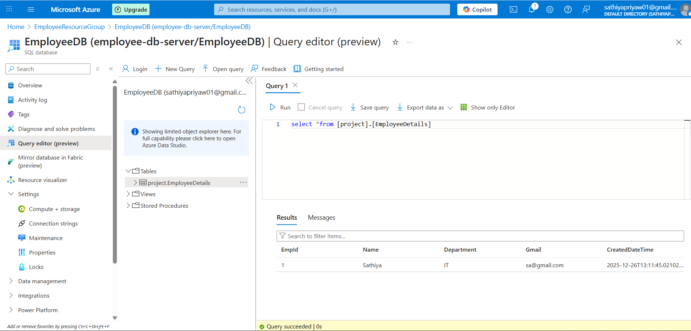
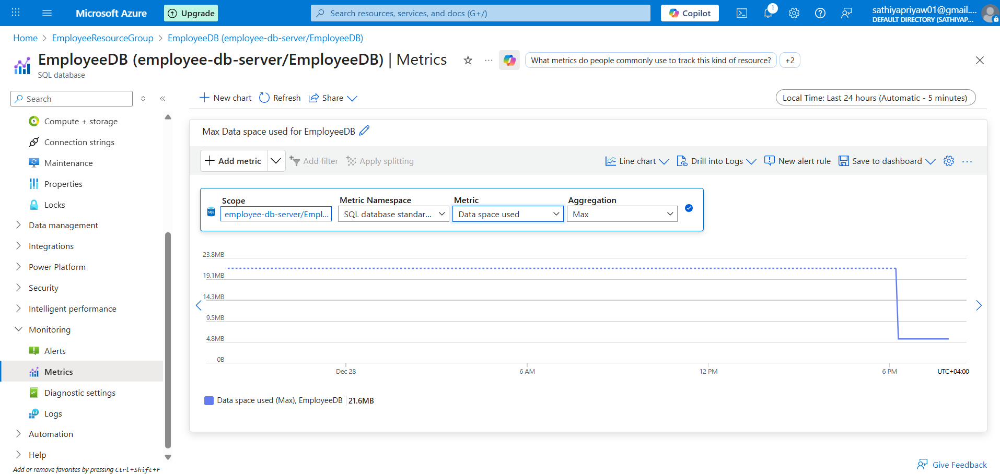
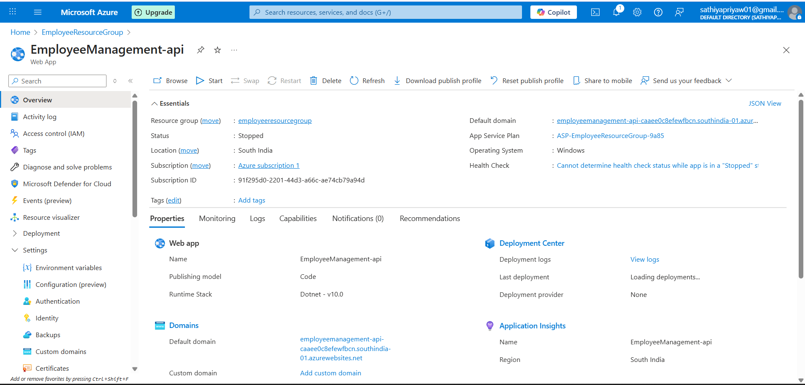
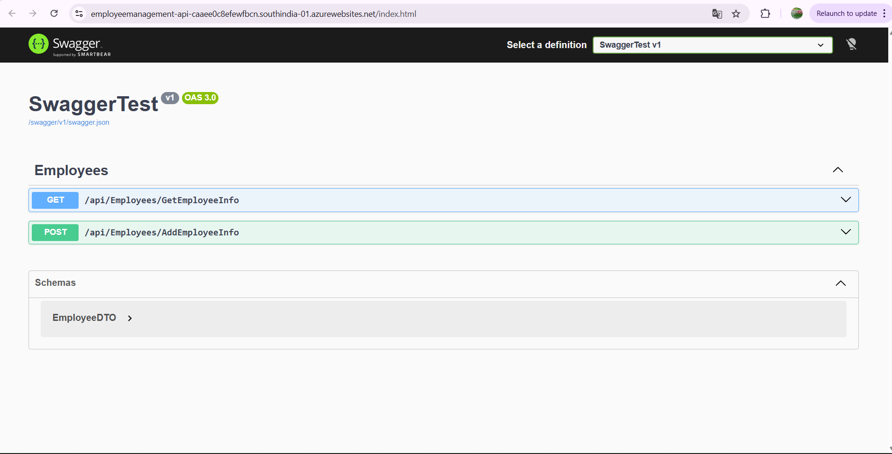
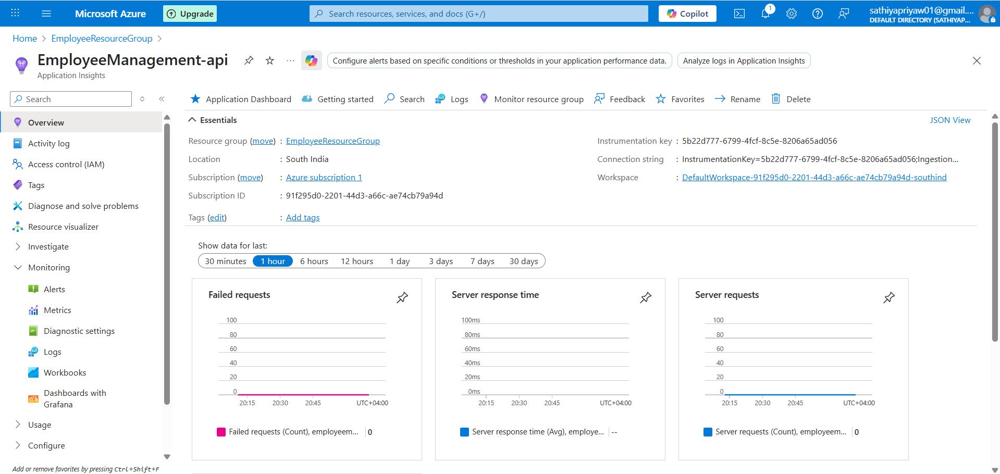
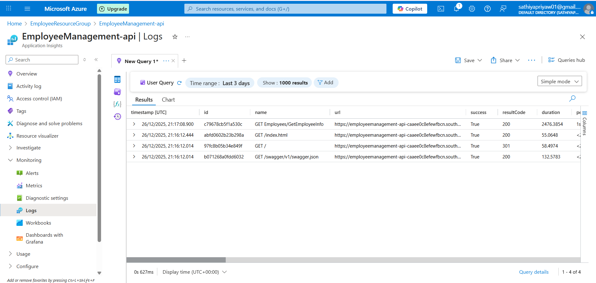

# EmployeeManagement-API

## Description
EmployeeManagement-API is an ASP.NET Core WebAPI Application that allows to Manage Employee Data. 
Hosted on **Azure App Service**, using **Azure SQL Database** as Storage, and Monitored and logged with **Application Insights**.
Connection strings are secured via Azure App Service Application Settings.

----------

## Tech Stack
-ASP.NET Core WebAPI(.Net 10)
-Entity Framework Core
-Azure App Service
-Azure SQL Database
-Application Insights
-Swagger

----------

## Features
-Cloud Hosted Rest API
-Secure configuration using App Setting
-Application Monitoring with Azure Insights

----------

## Screenshots

### Azure SQL Database

Shows service Name, URL, Region and Pricing Tier


Connection string configured for the API.(Password Masked)


Shows 'EmployeeDetails' Table and data


Displays cpu usage and database metrics

----------

### Azure App Service


Shows service Name, URL, Region and Pricing Tier


Shows Connection string configured via Application setting


Shows main page of the running application.(Swagger UI)

----------

### Application Insights


Overview of Application Insights Monitoring


show requests, Logs,response times and failures.

----------

## API Endpoints
**Swagger UI**
https://employeemanagement-api-caaee0c8efewfbcn.southindia-01.azurewebsites.net/index.html

**Get Employee Info**
Get/api/Employees/GetEmployeeInfo{id}
[url](https://employeemanagement-api-caaee0c8efewfbcn.southindia-01.azurewebsites.net/api/Employees/GetEmployeeInfo/{id})

**Add Employee Info**
Post/api/Employees/AddEmployeeInfo
[url](https://employeemanagement-api-caaee0c8efewfbcn.southindia-01.azurewebsites.net/api/Employees/AddEmployeeInfo)

## Clone the repository
	```bash 
	git clone https://github.com/sathiyapriyaw01-wq/EmployeeManagement-API.git
